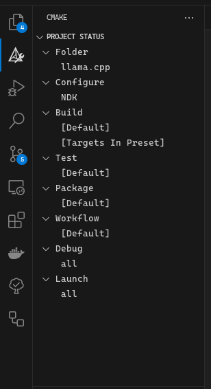
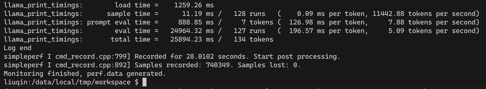
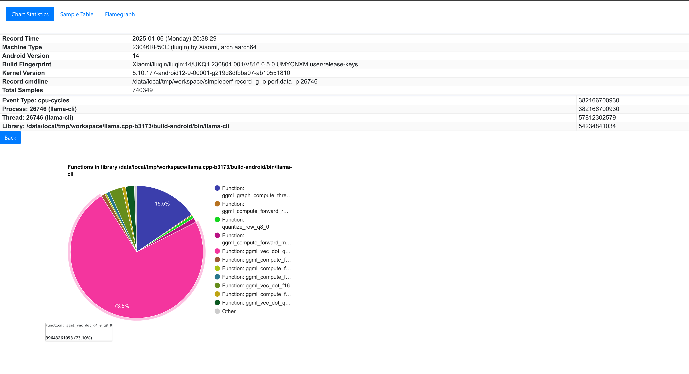
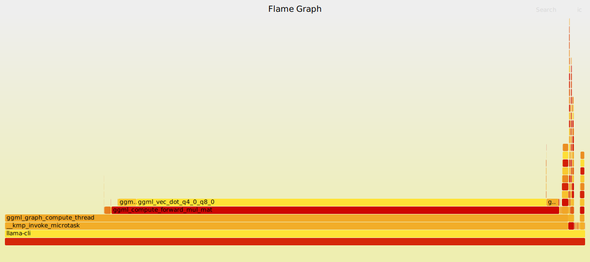
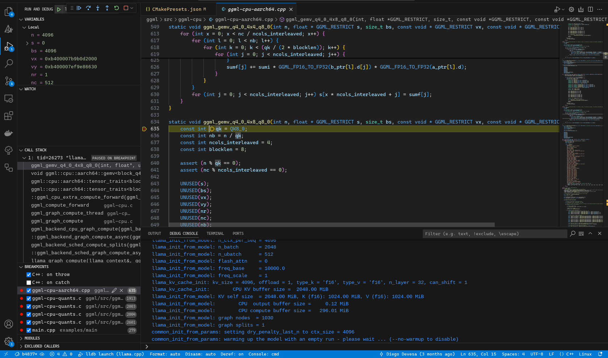

---
date:
    - created: 2024-02-01
---
# llama.cpp学习

### 介绍：
llama.cpp,版本是b3173,github地址:https://github.com/ggerganov/llama.cpp/releases?q=b3173&expanded=true 本文档记录将其部署在arm平台的实验代码和操作流程以供参考
### 部署说明：
1. 使用adb直接连接设备,代码放在/data/local/tmp/workspace/llama.cpp-b3173
2. android端的编译可以参考 官方文档,编译的ndk可以使用android studio下载后,在x86端编译arm的二进制文件,编译使用cmake.
### 下载代码
b3173： https://github.com/ggerganov/llama.cpp/releases?q=b3173&expanded=true
### 编译代码（安卓版本）：
#### 1. 直接使用命令：
```bash
cmake \
  -DCMAKE_TOOLCHAIN_FILE=
  ~/Android/Sdk/ndk/28.0.12674087/build/cmake/android.toolchain.cmake \
  -DANDROID_ABI=arm64-v8a \
  -DANDROID_PLATFORM=android-28 \
  -DCMAKE_C_FLAGS="-march=armv8.7a" \
  -DCMAKE_CXX_FLAGS="-march=armv8.7a" \
  -DGGML_OPENMP=OFF \
  -DGGML_LLAMAFILE=OFF \
  -B build-android
```
-DCMAKE_TOOLCHAIN_FILE=`${系统的ndk编译工具链地址}`
#### 2.使用vscode搭配CMakePreset.json
这里是CMakePresets.json的一个示例，编译后的文件在`"binaryDir": "${sourceDir}/out/build/${presetName}"`
```json
{
    "version": 4,
    "configurePresets": [
        {
            "name": "NDK-cross-compile",
            "displayName": "NDK",
            "description": "make",
            "binaryDir": "${sourceDir}/out/build/${presetName}",
            "cacheVariables": {
                "CMAKE_BUILD_TYPE": "Debug",
                "CMAKE_TOOLCHAIN_FILE": "~/Android/Sdk/ndk/28.0.12674087/build/cmake/android.toolchain.cmake",
                "CMAKE_INSTALL_PREFIX": "${sourceDir}/out/install/${presetName}",
                "CMAKE_C_FLAGS": "-march=armv8.7a",
                "CMAKE_CXX_FLAGS": "-march=armv8.7a",
                "GGML_OPENMP": "OFF",
                "GGML_LLAMAFILE": "OFF",
                "ANDROID_ABI": "arm64-v8a",
                "ANDROID_PLATFORM": "android-28"
            }
        }
    ]
}
```
之后可以使用图形化界面直接build
### 运行交互：


使用
```bash
adb push ./out/build/ndk /data/local/tmp/
```
将编译后的文件传输到/data/local/tmp/ndk文件夹下

### 评估性能：
编写监控脚本monitor.sh
```bash
#!/system/bin/sh
# monitor.sh

# 启动 llama-cli 并获取 PID
./llama.cpp-b3173/build-android/bin/llama-cli -m ./q4_0/ggml-model-Q4_0.gguf -p "what is the meaning of life" -n 128 &
PID=$!

# # 启动 simpleperf，监控 llama-cli 进程
# ./simpleperf stat -e cache-references,cache-references:u,cache-references:k \
#       -e cache-misses,cache-misses:u,cache-misses:k,instructions \
#       -p $PID & 

./simpleperf record -g -o perf.data -p $PID & --dump
SIMPLEPERF_PID=$!

# 等待 llama-cli 进程结束
wait $PID

# 等待 simpleperf 结束（如果它还在运行）
wait $SIMPLEPERF_PID

# 在此时，llama-cli 和 simpleperf 都已经结束
echo "Monitoring finished, perf.data generated."
```
注意adb环境使用sh,而非bash。
PID=$!是获得刚刚启动的进程pid的好办法

推送monitor.sh到设备
```bash
adb push path_to_monitor.sh /data/local/tmp/workspace/
```

运行脚本：

拉取perf.data文件：
```bash
adb pull /data/local/tmp/workspace/perf.data perf.data
```

使用ndk下的simpleperf文件夹下的工具处理数据
例如我的simpleperf地址是：~/Android/Sdk/ndk/28.0.12674087/simpleperf
代码中也附加有mysimpleperf以供使用
```bash
simpleperf report 生成报告
分析生成report.txt
"simpleperf report -i /sdcard/perf.data -o /sdcard/report.txt"
"simpleperf report -g -i /sdcard/perf.data -o /sdcard/report_g.txt"

生成调用关系图
simpleperf report -g --symfs . >report

生成report.html
python report_html.py -i ./perf.data -o ./perf.html
生成火焰图(这里需要下载FlameGraph项目)
python ./simpleperf/report_sample.py > out.perf
./FlameGraph/stackcollapse-perf.pl out.perf > out.folded
./FlameGraph/flamegraph.pl out.folded > out.svg
```

report.html示意：


火焰图：



### 使用lldb.server进行debug

#### 设置登陆调试脚本(.vscode/launch.json)
```json
{
    "version": "0.2.0",
    "configurations": [
        {
            "type": "lldb",
            "request": "launch",
            "name": "lldb launch",
            "program": "/data/local/tmp/workspace/ndk/bin/llama-cli",
            "args": [
                "-m",
                "/data/local/tmp/ggml-model-q4_0.gguf"
            ],
            "preLaunchTask": "build task",
            "initCommands": [
                "platform select remote-android",
                "platform connect connect://localhost:9090",
                "settings set target.inherit-env false",
                "platform settings -w /data/local/tmp/",
                "platform status"
            ],
            "env": {
                "LD_LIBRARY_PATH": "/data/local/tmp/workspace/ndk/bin"
            }
        }
    ]
}
```

#### 设置前置任务（tasks.json）
```json
{
    "version": "2.0.0",
    "tasks": [
        {
            "label": "build task",
            "type": "shell",
            "command": "bash debug.sh"
        }
    ]
}
```

具体的任务可以在debug.sh中调整
```bash
#!/bin/bash
# adb push /home/gyh/llama-test/llama.cpp-b3173/out/build/* /data/local/tmp/workspace/
adb forward tcp:9090 tcp:9090
# adb shell "cd /data/local/tmp && ./data/local/tmp/lldb-server platform --server --listen '*:9090'"
gnome-terminal -- bash -c "adb shell 'cd /data/local/tmp && ./lldb-server platform --listen *:9090 --server'"
```

之后可以在run and debug界面选择设置的登陆调试进行图形化调试
