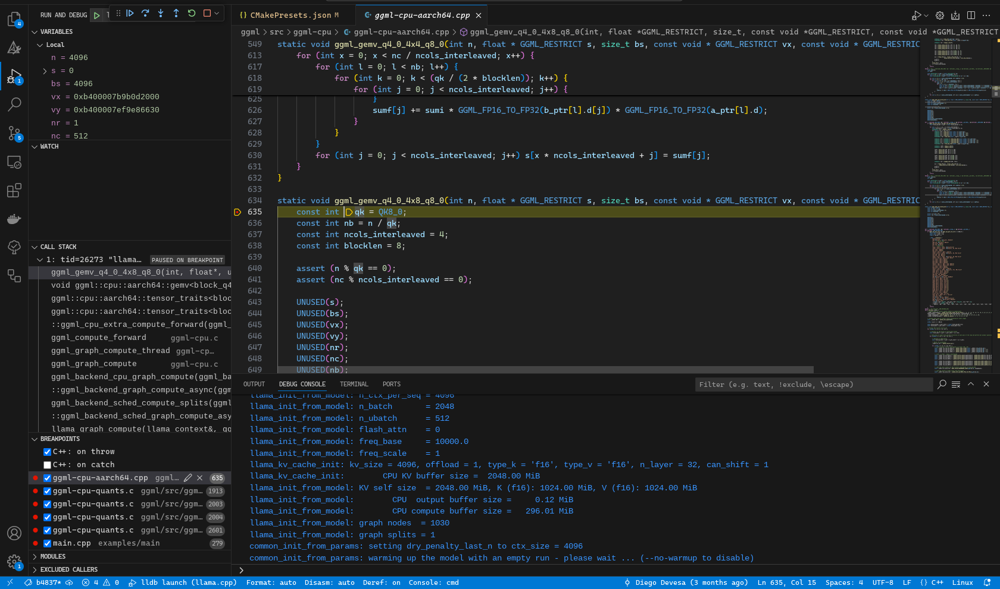
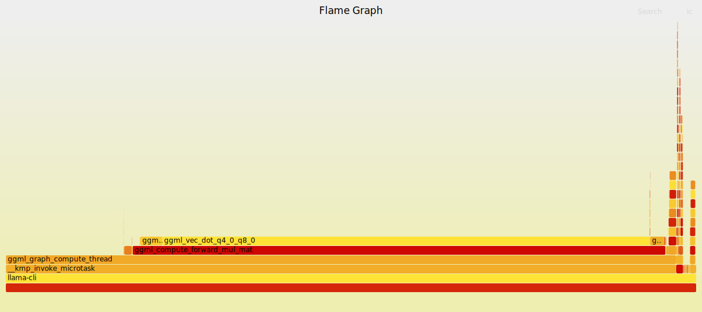

---
date:
    - created: 2024-02-01
---
现在需要配置使用vscode用于调试llama.cpp代码
在本地机（x86）使用交叉编译产生客户端（arm）的二进制文件
需要的工具以及操作顺序
1. 本地安装vscode
2. 本地安装cmake
3. 下载ndk
4. 下载llama.cpp源码
5. 配置vscode的llama.cpp项目完成调试功能

### 本地安装vscode
[vscode官方地址](https://code.visualstudio.com/)
安装插件：cmake,codelldb，c/c++（没有也行，但是这个很常用）

### 本地安装cmake
[cmake官方地址](https://cmake.org/download/)
[cmake安装教程](https://www.runoob.com/cmake/cmake-install-setup.html)
### 下载ndk
[ndk官方地址](https://developer.android.com/ndk/downloads?hl=zh-cn)
### 下载源码
```bash 
//bxxxx为特定数字版本
git clone -b bxxxx https://github.com/ggml-org/llama.cpp.git
```
### 配置llama.cpp工程
#### 在服务器端配置（有手机设备连接）
为了实现在服务器上编译，调试，需要按照以下步骤进行
1. 代码文件放在手机的/data/local/tmp/文件夹下
2. lldb-server放在/data/local/tmp/文件夹下（这个文件可以在~/android-ndk-r28-linux/android-ndk-r28/toolchains/llvm/prebuilt/linux-x86_64/lib/clang/19/lib/linux/aarch64的路径下找到，这条信息只是为了方便更新文件所作提示（如有必要））
接下来请按照步骤进行：
##### step 1 生成makefile
###### 方式一：直接使用命令：
直接运行下面这条命令可以生成makefile，相关的配置文件在build-android文件夹下
请修改为你的CMAKE_TOOLCHAIN_FILE为你的ndk下的toolchain路径
```bash
cmake \
  -DCMAKE_TOOLCHAIN_FILE=
  ~/Android/Sdk/ndk/28.0.12674087/build/cmake/android.toolchain.cmake \
  -DANDROID_ABI=arm64-v8a \
  -DANDROID_PLATFORM=android-28 \
  -DCMAKE_C_FLAGS="-march=armv8.7a" \
  -DCMAKE_CXX_FLAGS="-march=armv8.7a" \
  -DGGML_OPENMP=OFF \
  -DGGML_LLAMAFILE=OFF \
  -B build-android
```
-DCMAKE_TOOLCHAIN_FILE=`${系统的ndk编译工具链地址}`

###### 方式二：使用vscode搭配CMakePreset.json
这里是CMakePresets.json的一个示例，编译后的文件在`"binaryDir": "${sourceDir}/out/build/${presetName}"`
```json
{
    "version": 4,
    "configurePresets": [
        {
            "name": "NDK-cross-compile",
            "displayName": "NDK",
            "description": "make",
            "binaryDir": "${sourceDir}/out/build/${presetName}",
            "cacheVariables": {
                "CMAKE_BUILD_TYPE": "Debug",
                "CMAKE_TOOLCHAIN_FILE": "~/Android/Sdk/ndk/28.0.12674087/build/cmake/android.toolchain.cmake",
                "CMAKE_INSTALL_PREFIX": "${sourceDir}/out/install/${presetName}",
                "CMAKE_C_FLAGS": "-march=armv8.7a",
                "CMAKE_CXX_FLAGS": "-march=armv8.7a",
                "GGML_OPENMP": "OFF",
                "GGML_LLAMAFILE": "OFF",
                "ANDROID_ABI": "arm64-v8a",
                "ANDROID_PLATFORM": "android-28"
            }
        }
    ]
}
```
之后可以使用图形化界面直接build,每次修改完cmake相关配置文件，记得要重新生成makefile,在这里点configure。


##### step 2 生成二进制文件
如果之前使用命令行形式，那么使用下面这条命令
```bash
cmake --build build-android --config Release -j{n}
```
如果使用vscode配置图形化命令
点这里：


最终生成的二进制文件在out/build/ndk/bin下

##### step 3 将生成的二进制文件传送到手机设备
```bash
//首先切到llama.cpp的项目目录下
adb push ./out/build/ndk /data/local/tmp/workspace/
```

##### step 4 调试代码
如果需要运行代码，直接到设备端对应的目录下运行二进制文件
现在想要提供一个图形界面的调试方式
具体原理是lldb-server监控设备端程序运行并把信息发送给主机端，主机端使用codelldb以提供图形界面

###### step4.1
首先需要写一个launch.json脚本以便在程序运行时连接到设备端并将lldb附加到程序上("./vscode/launch.json")
```json 
{
    "version": "0.2.0",
    "configurations": [
        {
            "type": "lldb",
            "request": "launch",
            "name": "lldb launch",
            "program": "/data/local/tmp/workspace/ndk/bin/llama-cli",
            "args": [
                "-m",
                "/data/local/tmp/ggml-model-q4_0.gguf"
            ],
            "preLaunchTask": "build task",
            "initCommands": [
                "platform select remote-android",
                "platform connect connect://localhost:9090",
                "settings set target.inherit-env false",
                "platform settings -w /data/local/tmp/",
                "platform status"
            ],
            "env": {
                "LD_LIBRARY_PATH": "/data/local/tmp/workspace/ndk/bin"
            }
        }
    ]
}
```
解释：
1. 在env中加入以/data/local/tmp/workspace/ndk/bin路径作为附加链接库路径，可以改为其他路径，在对应路径下运行二进制文件，加上LD_LIBRARY_PATH=.作为前缀，这样二进制文件就可以链接到库
2. initcommands是初始化命令，用于自动连接设备
3. preLaunchTask代表前置任务，在每次连接设备前做的事
4. programs和args代表运行程序所在位置和附加变量，二进制文件和模型的位置需要可以改动
###### step 4.2
接着写一个tasks.json(./vscode/tasks.json)用于配置前置任务
```json
{
    "version": "2.0.0",
    "tasks": [
        {
            "label": "build task",
            "type": "shell",
            "command": "bash debug.sh"
        }
    ]
}
```
###### step 4.3
tasks.json运行debug.sh中的命令用于执行前置任务(./debug.sh)，接下来写一个debug.sh

```bash
#!/bin/bash
# adb push /home/gyh/llama-test/llama.cpp-b3173/out/build/* /data/local/tmp/workspace/
adb forward tcp:9090 tcp:9090
# adb shell "cd /data/local/tmp && ./data/local/tmp/lldb-server platform --server --listen '*:9090'"
gnome-terminal -- bash -c "adb shell 'cd /data/local/tmp && ./lldb-server platform --listen *:9090 --server'"
```
注释掉的2句用于推送二进制文件和直接使用adb执行命令(因为对于不同的桌面环境可能需要调整)

之后可以在run and debug界面选择设置的登陆调试进行图形化调试


#### 在本地端配置（没有手机设备连接）
首先参照前文在本地配置好编译出二进制文件[**step 2 生成二进制文件**]这一节

##### step 1 安装qemu
请安装qemu，官方有一个[教程](https://learn.arm.com/learning-paths/servers-and-cloud-computing/sve/sve_armie/)
这里有一个qemu官方关于sve特性的说明可以[参考](https://qemu-project.gitlab.io/qemu/system/arm/cpu-features.html)

```bash
sudo apt install qemu-user -y
//这里缺什么库就安装一下，参考qemu的安装文档
```

修改cmakepresets.json如下
```json
{
    "name": "ndk",
    "displayName": "NDK",
    "description": "使用NDK工具链交叉编译",
    "binaryDir": "${sourceDir}/out/build/${presetName}",
    "cacheVariables": {
        "CMAKE_BUILD_TYPE": "Debug",
        "CMAKE_TOOLCHAIN_FILE": "~/Android/Sdk/ndk/29.0.13113456/build/cmake/android.toolchain.cmake",
        "CMAKE_INSTALL_PREFIX": "${sourceDir}/out/install/${presetName}",
        "CMAKE_C_FLAGS": "-march=armv8.7a+sve+sve2 -g -static",
        "CMAKE_CXX_FLAGS": "-march=armv8.7a+sve+sve2 -g -static",
        "GGML_OPENMP":"OFF",
        "GGML_LLAMAFILE":"OFF",
        "BUILD_SHARED_LIBS":"OFF",
        "ANDROID_ABI": "arm64-v8a",
        "ANDROID_PLATFORM": "android-35"
    }
}
```

请修改toolchain路径为你本机安装路径
这里关闭共享库的构建，以便于构建静态二进制文件

用户模式运行llama-cli的命令，-m 后是你的模型地址。
```bash
qemu-aarch64 -cpu max ./out/build/ndk/bin/llama-cli -m ~/workspace/chat-llama2-1b-1.0.Q4_0.gguf
```
可以使用相同的格式运行其他二进制文件。

本地可以验证你的代码运行是否正常，如果想要在本地调试运行，请自行搜索qemu的调试教程，qemu提供了一套调试接口。由于本次使用的是用户模式，并没有模拟cpu寄存器特性，所以想要观察特定的寄存器动作，仍然需要到设备端DEBUG。本地使用打印输出和断言判断即可。


### 测试性能
#### step1 编写测试脚本
编写监控脚本monitor.sh
```bash
#!/system/bin/sh
# monitor.sh

# 启动 llama-cli 并获取 PID
./llama.cpp-b3173/build-android/bin/llama-cli -m ./q4_0/ggml-model-Q4_0.gguf -p "what is the meaning of life" -n 128 &
PID=$!

# # 启动 simpleperf，监控 llama-cli 进程
# ./simpleperf stat -e cache-references,cache-references:u,cache-references:k \
#       -e cache-misses,cache-misses:u,cache-misses:k,instructions \
#       -p $PID & 

./simpleperf record -g -o perf.data -p $PID & --dump
SIMPLEPERF_PID=$!

# 等待 llama-cli 进程结束
wait $PID

# 等待 simpleperf 结束（如果它还在运行）
wait $SIMPLEPERF_PID

# 在此时，llama-cli 和 simpleperf 都已经结束
echo "Monitoring finished, perf.data generated."
```
注意adb环境使用sh,而非bash。
PID=$!是获得刚刚启动的进程pid的好办法

#### step2 推送monitor.sh到设备
```bash
adb push path_to_monitor.sh /data/local/tmp/workspace/
```

运行脚本：

拉取perf.data文件：
```bash
adb pull /data/local/tmp/workspace/perf.data perf.data
```

#### step3 处理数据

使用ndk下的simpleperf文件夹下的工具处理数据
例如我的simpleperf地址是：~/Android/Sdk/ndk/28.0.12674087/simpleperf
代码中也附加有mysimpleperf以供使用
```bash
simpleperf report 生成报告
分析生成report.txt
"simpleperf report -i /sdcard/perf.data -o /sdcard/report.txt"
"simpleperf report -g -i /sdcard/perf.data -o /sdcard/report_g.txt"

生成调用关系图
simpleperf report -g --symfs . >report

生成report.html
python report_html.py -i ./perf.data -o ./perf.html
```

report.html示意：


火焰图：
