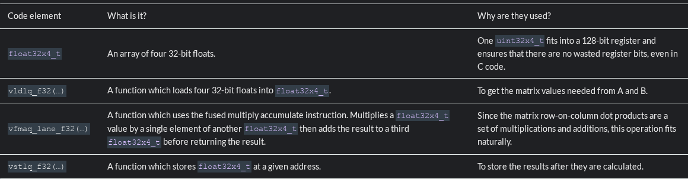
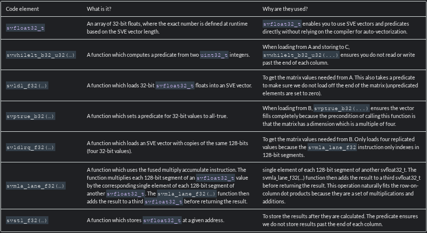

---

date:
    created: 2025-03-14
---

[翻译原文](https://developer.arm.com/documentation/102131/0100/Part-Four---Migrate-your-Neon-code-to-SVE)
迁移你的neon代码到sve


迁移代码的过程略有不同，这个取决于代码是否使用高级语言，例如c/c++或者Fortran，亦或者你的代码使用汇编
为了将c/c++，Fortran这样的高级语言迁移到SVE VLA模式(Vector Length Agnostic矢量长度不可知)，你需要：
更新你的编译选项(包括自动向量化选项)
尽可能参考sve规范，使用sve内建函数代替neon内建函数
将代码和数学库的sve变体连接

如果你正在写vla汇编，你应该
更新你的编译选项(包括自动向量化选项)
尽可能参考手册使用sve重写你的代码并将您的代码和数学库的sve变体链接

以下示例如何将优化好的neon代码（c语言编写）使用acle sve重写为优化的sve代码

示例不包含重写neon优化的汇编


示例一，使用内建函数重写简单矩阵乘法
这个示例使用了neon内建函数实现了一些c函数。所选示例没有展示应用的全部复杂性，但说明了内建函数的使用方法，并且是更复杂代码的起点，在这个示例中，我们使用sve内建函数重写代码

矩阵乘法是一种在数据密集型应用中的操作并且由一组简单重复的数学操作组成

矩阵乘法图
[Figure 1. Matrix multiplication diagram](https://documentation-service.arm.com/static/667c2d79e03ddf7643cba7ce?token=)
矩阵乘法过程如下：

1. 取得A矩阵中的一行
2. 对这行和矩阵B的一列进行点乘操作
3. 将结果储存到C矩阵对应的行和列中
对于32位浮点矩阵，乘法可以表示为
```cpp
void matrix_multiply_c(float32_t *A, float32_t *B, float32_t *C, uint32_t n, uint32_t m, uint32_t k) {
    for (int i_idx=0; i_idx < n; i_idx++) {
        for (int j_idx=0; j_idx < m; j_idx++) {
            C[n*j_idx + i_idx] = 0;
            for (int k_idx=0; k_idx < k; k_idx++) {
                C[n*j_idx + i_idx] += A[n*k_idx + i_idx]*B[k*j_idx + k_idx];
            }
        }
    }
}
```
That is, an n x m matrix M, is represented as an array M_array, where Mij = M_array[n*j + i].
假设矩阵使用列主序存储，意味着nXm的矩阵M,被表示为数组M（M_array），Mij被映射到M_array[n*j+i]。
!!!理解：列主序，在M_array中存储的是矩阵的一列一列，（1,2）（实际上是第2行第3列呢）被映射到（2个列即n*j加上1个元素i的位置上）

This code is suboptimal, because it does not make full use of Neon. Intrinsics can be used to improve it.
这段代买优化效率不高，yin wei，因为他没有充分利用neon,可以使用内联函数改进它

以下代码使用neon内建函数计算两个4X4矩阵相乘，因为数据量比较小且固定，所有这些值可以同时放入寄存器。这个循环可以完全展开
```cpp
void matrix_multiply_4x4_neon(const float32_t *A, const float32_t *B, float32_t *C) {
    // these are the columns A
    float32x4_t A0;
    float32x4_t A1;
    float32x4_t A2;
    float32x4_t A3;

    // these are the columns B
    float32x4_t B0;
    float32x4_t B1;
    float32x4_t B2;
    float32x4_t B3;

    // these are the columns C
    float32x4_t C0;
    float32x4_t C1;
    float32x4_t C2;
    float32x4_t C3;

    A0 = vld1q_f32(A);
    A1 = vld1q_f32(A+4);
    A2 = vld1q_f32(A+8);
    A3 = vld1q_f32(A+12);

    // Zero accumulators for C values
    C0 = vmovq_n_f32(0);
    C1 = vmovq_n_f32(0);
    C2 = vmovq_n_f32(0);
    C3 = vmovq_n_f32(0);

    // Multiply accumulate in 4x1 blocks, that is each column in C
    B0 = vld1q_f32(B);
    C0 = vfmaq_laneq_f32(C0, A0, B0, 0);
    C0 = vfmaq_laneq_f32(C0, A1, B0, 1);
    C0 = vfmaq_laneq_f32(C0, A2, B0, 2);
    C0 = vfmaq_laneq_f32(C0, A3, B0, 3);
    vst1q_f32(C, C0);

    B1 = vld1q_f32(B+4);
    C1 = vfmaq_laneq_f32(C1, A0, B1, 0);
    C1 = vfmaq_laneq_f32(C1, A1, B1, 1);
    C1 = vfmaq_laneq_f32(C1, A2, B1, 2);
    C1 = vfmaq_laneq_f32(C1, A3, B1, 3);
    vst1q_f32(C+4, C1);

    B2 = vld1q_f32(B+8);
    C2 = vfmaq_laneq_f32(C2, A0, B2, 0);
    C2 = vfmaq_laneq_f32(C2, A1, B2, 1);
    C2 = vfmaq_laneq_f32(C2, A2, B2, 2);
    C2 = vfmaq_laneq_f32(C2, A3, B2, 3);
    vst1q_f32(C+8, C2);

    B3 = vld1q_f32(B+12);
    C3 = vfmaq_laneq_f32(C3, A0, B3, 0);
    C3 = vfmaq_laneq_f32(C3, A1, B3, 1);
    C3 = vfmaq_laneq_f32(C3, A2, B3, 2);
    C3 = vfmaq_laneq_f32(C3, A3, B3, 3);
    vst1q_f32(C+12, C3);
}
```
选择固定大小的4X4矩阵，因为：

某些应用程序需要特定的 4x4 矩阵，例如：图形或相对论物理学。
霓虹矢量寄存器包含四个 32 位值。将应用程序与架构相匹配可以使其优化更容易。
这个 4x4 内核可以用于更通用的内核。
本例中使用的 Neon 内嵌函数有



使用sve内建函数重写neon内建函数，以下：
```cpp
void matrix_multiply_nx4_sve(const float32_t *A, const float32_t *B, float32_t *C, uint32_t n) {
    // these are the columns A
    svfloat32_t A0;
    svfloat32_t A1;
    svfloat32_t A2;
    svfloat32_t A3;

    // these are the columns B
    svfloat32_t B0;
    svfloat32_t B1;
    svfloat32_t B2;
    svfloat32_t B3;

    // these are the columns C
    svfloat32_t C0;
    svfloat32_t C1;
    svfloat32_t C2;
    svfloat32_t C3;

    svbool_t pred = svwhilelt_b32_u32(0, n);
    A0 = svld1_f32(pred, A);
    A1 = svld1_f32(pred, A+n);
    A2 = svld1_f32(pred, A+2*n);
    A3 = svld1_f32(pred, A+3*n);

    // Zero accumulators for C values
    C0 = svdup_n_f32(0);
    C1 = svdup_n_f32(0);
    C2 = svdup_n_f32(0);
    C3 = svdup_n_f32(0);

    // Multiply accumulate in 4x1 blocks, that is each column in C
    B0 = svld1rq_f32(svptrue_b32(), B);
    C0 = svmla_lane_f32(C0, A0, B0, 0);
    C0 = svmla_lane_f32(C0, A1, B0, 1);
    C0 = svmla_lane_f32(C0, A2, B0, 2);
    C0 = svmla_lane_f32(C0, A3, B0, 3);
    svst1_f32(pred, C, C0);

    B1 = svld1rq_f32(svptrue_b32(), B+4);
    C1 = svmla_lane_f32(C1, A0, B1, 0);
    C1 = svmla_lane_f32(C1, A1, B1, 1);
    C1 = svmla_lane_f32(C1, A2, B1, 2);
    C1 = svmla_lane_f32(C1, A3, B1, 3);
    svst1_f32(pred, C+4, C1);

    B2 = svld1rq_f32(svptrue_b32(), B+8);
    C2 = svmla_lane_f32(C2, A0, B2, 0);
    C2 = svmla_lane_f32(C2, A1, B2, 1);
    C2 = svmla_lane_f32(C2, A2, B2, 2);
    C2 = svmla_lane_f32(C2, A3, B2, 3);
    svst1_f32(pred, C+8, C2);

    B3 = svld1rq_f32(svptrue_b32(), B+12);
    C3 = svmla_lane_f32(C3, A0, B3, 0);
    C3 = svmla_lane_f32(C3, A1, B3, 1);
    C3 = svmla_lane_f32(C3, A2, B3, 2);
    C3 = svmla_lane_f32(C3, A3, B3, 3);
    svst1_f32(pred, C+12, C3);
}
```




重要的一点不同就是可以忽略矩阵的一个维度，因为sve中具有变长向量特性。或者您可以显式地传递n维向量的长度，并使用预测寄存器来保证不会超过它

Example Two - Rewriting a larger matrix multiplication code with intrinsics
示例二，使用内联函数重写较大的矩阵乘法

To multiply larger matrices, treat them as blocks of 4x4 matrices. However, this approach only works with matrix sizes which are a multiple of four in both dimensions. To use this method without changing it, pad the matrix with zeroes.

The Neon code for a more general matrix multiplication is listed below. The structure of the kernel has changed with the addition of loops and address calculations being the major changes. Like in the 4x4 kernel, unique variable names are used for the B columns. The alternative would be to use one variable and re-load it. This acts as a hint to the compiler to assign different registers to these variables. Assigning different registers enables the processor to complete the arithmetic instructions for one column, while waiting on the loads for another.

```cpp
void matrix_multiply_neon(const float32_t *A, const float32_t *B, float32_t *C, uint32_t n, uint32_t m, uint32_t k) {
    /*
     * Multiply matrices A and B, store the result in C.
     * It is the users responsibility to make sure the matrices are compatible.
     */

    int a_idx;
    int b_idx;
    int c_idx;

    // these are the columns of a 4x4 sub matrix of A
    float32x4_t A0;
    float32x4_t A1;
    float32x4_t A2;
    float32x4_t A3;

    // these are the columns of a 4x4 sub matrix of B
    float32x4_t B0;
    float32x4_t B1;
    float32x4_t B2;
    float32x4_t B3;

    // these are the columns of a 4x4 sub matrix of C
    float32x4_t C0;
    float32x4_t C1;
    float32x4_t C2;
    float32x4_t C3;

    for (int i_idx=0; i_idx<n; i_idx+=4) {
        for (int j_idx=0; j_idx<m; j_idx+=4) {
            // zero accumulators before matrix op
            C0 = vmovq_n_f32(0);
            C1 = vmovq_n_f32(0);
            C2 = vmovq_n_f32(0);
            C3 = vmovq_n_f32(0);
            for (int k_idx=0; k_idx<k; k_idx+=4){
                // compute base index to 4x4 block
                a_idx = i_idx + n*k_idx;
                b_idx = k*j_idx + k_idx;

                // load most current a values in row
                A0 = vld1q_f32(A+a_idx);
                A1 = vld1q_f32(A+a_idx+n);
                A2 = vld1q_f32(A+a_idx+2*n);
                A3 = vld1q_f32(A+a_idx+3*n);

                // multiply accumulate 4x1 blocks, that is each column C
                B0 = vld1q_f32(B+b_idx);
                C0 = vfmaq_laneq_f32(C0,A0,B0,0);
                C0 = vfmaq_laneq_f32(C0,A1,B0,1);
                C0 = vfmaq_laneq_f32(C0,A2,B0,2);
                C0 = vfmaq_laneq_f32(C0,A3,B0,3);

                B1 = vld1q_f32(B+b_idx+k);
                C1 = vfmaq_laneq_f32(C1,A0,B1,0);
                C1 = vfmaq_laneq_f32(C1,A1,B1,1);
                C1 = vfmaq_laneq_f32(C1,A2,B1,2);
                C1 = vfmaq_laneq_f32(C1,A3,B1,3);

                B2 = vld1q_f32(B+b_idx+2*k);
                C2 = vfmaq_laneq_f32(C2,A0,B2,0);
                C2 = vfmaq_laneq_f32(C2,A1,B2,1);
                C2 = vfmaq_laneq_f32(C2,A2,B2,2);
                C2 = vfmaq_laneq_f32(C2,A3,B2,3);

                B3 = vld1q_f32(B+b_idx+3*k);
                C3 = vfmaq_laneq_f32(C3,A0,B3,0);
                C3 = vfmaq_laneq_f32(C3,A1,B3,1);
                C3 = vfmaq_laneq_f32(C3,A2,B3,2);
                C3 = vfmaq_laneq_f32(C3,A3,B3,3);
            }
            // compute base index for stores
            c_idx = n*j_idx + i_idx;
            vst1q_f32(C+c_idx, C0);
            vst1q_f32(C+c_idx+n,C1);
            vst1q_f32(C+c_idx+2*n,C2);
            vst1q_f32(C+c_idx+3*n,C3);
        }
    }
}
```
Compiling and disassembling this function, and comparing it with the C function shows:

Fewer arithmetic instructions for a given matrix multiplication, because it utilizes the Advanced SIMD technology with full register packing. Typical C code, generally, does not.
FMLA instead of FMUL instructions. As specified by the intrinsics.
Fewer loop iterations. When used properly intrinsics allow loops to be unrolled easily.
However, there are unnecessary loads and stores because of memory allocation and initialization of data types (for example, float32x4_t) which are not used in the no-intrinsics C code.

Re-writing the code to use SVE intrinsics instead of Neon intrinsics, could give you:

```cpp
void matrix_multiply_sve(const float32_t *A, const float32_t *B, float32_t *C, uint32_t n, uint32_t m, uint32_t k) {
    /*
     * Multiply matrices A and B, store the result in C.
     * It is the users responsibility to make sure the matrices are compatible.
     */

    int a_idx;
    int b_idx;
    int c_idx;

    // these are the columns of a nx4 sub matrix of A
    svfloat32_t A0;
    svfloat32_t A1;
    svfloat32_t A2;
    svfloat32_t A3;

    // these are the columns of a 4x4 sub matrix of B
    svfloat32_t B0;
    svfloat32_t B1;
    svfloat32_t B2;
    svfloat32_t B3;

    // these are the columns of a nx4 sub matrix of C
    svfloat32_t C0;
    svfloat32_t C1;
    svfloat32_t C2;
    svfloat32_t C3;

    for (int i_idx=0; i_idx<n; i_idx+=svcntw()) {
        // calculate predicate for this i_idx
        svbool_t pred = svwhilelt_b32_u32(i_idx, n);

        for (int j_idx=0; j_idx<m; j_idx+=4) {
            // zero accumulators before matrix op
            C0 = svdup_n_f32(0);
            C1 = svdup_n_f32(0);
            C2 = svdup_n_f32(0);
            C3 = svdup_n_f32(0);
            for (int k_idx=0; k_idx<k; k_idx+=4){
                // compute base index to 4x4 block
                a_idx = i_idx + n*k_idx;
                b_idx = k*j_idx + k_idx;

                // load most current a values in row
                A0 = svld1_f32(pred, A+a_idx);
                A1 = svld1_f32(pred, A+a_idx+n);
                A2 = svld1_f32(pred, A+a_idx+2*n);
                A3 = svld1_f32(pred, A+a_idx+3*n);

                // multiply accumulate 4x1 blocks, that is each column C
                B0 = svld1rq_f32(svptrue_b32(), B+b_idx);
                C0 = svmla_lane_f32(C0,A0,B0,0);
                C0 = svmla_lane_f32(C0,A1,B0,1);
                C0 = svmla_lane_f32(C0,A2,B0,2);
                C0 = svmla_lane_f32(C0,A3,B0,3);

                B1 = svld1rq_f32(svptrue_b32(), B+b_idx+k);
                C1 = svmla_lane_f32(C1,A0,B1,0);
                C1 = svmla_lane_f32(C1,A1,B1,1);
                C1 = svmla_lane_f32(C1,A2,B1,2);
                C1 = svmla_lane_f32(C1,A3,B1,3);

                B2 = svld1rq_f32(svptrue_b32(), B+b_idx+2*k);
                C2 = svmla_lane_f32(C2,A0,B2,0);
                C2 = svmla_lane_f32(C2,A1,B2,1);
                C2 = svmla_lane_f32(C2,A2,B2,2);
                C2 = svmla_lane_f32(C2,A3,B2,3);

                B3 = svld1rq_f32(svptrue_b32(), B+b_idx+3*k);
                C3 = svmla_lane_f32(C3,A0,B3,0);
                C3 = svmla_lane_f32(C3,A1,B3,1);
                C3 = svmla_lane_f32(C3,A2,B3,2);
                C3 = svmla_lane_f32(C3,A3,B3,3);
            }
            // compute base index for stores
            c_idx = n*j_idx + i_idx;
            svst1_f32(pred, C+c_idx, C0);
            svst1_f32(pred, C+c_idx+n,C1);
            svst1_f32(pred, C+c_idx+2*n,C2);
            svst1_f32(pred, C+c_idx+3*n,C3);
        }
    }
}
```
This code is almost identical to the earlier Neon code except for the differing intrinsics, and in addition, thanks to predication, there is no longer a constraint on the number of rows of A. However, you must ensure that the number of columns of A and C, and both dimensions of B, are multiples of four because the predication used above does not account for this. Adding such further predication is possible but would reduce the clarity of this example.

Comparing it with the C function and Neon functions, the SVE example:

Uses WHILELT to determine the predicate for doing each iteration of the outer loop. This guarantees you have at least one element to do by the loop condition.
Increments i_idx by CNTW (the number of 32-bit elements in a vector) to avoid hard-coding the number of elements calculated in an iteration of the outer loop.