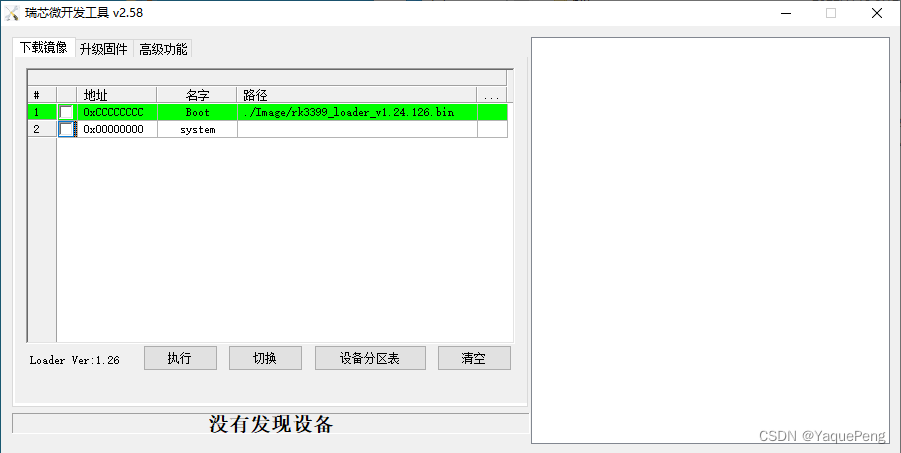

本文记录了tn3399 v3 emmc刷入钉钉f1板子的过程和学习

<!-- more -->

## 了解刷入系统结构
1. loader
```bash
./rkbin/tools/upgrade_tool db ./rk3399_loader_v1.22.119.bin
```
2. system
```bash
./rkbin/tools/upgrade_tool wl 0x0 ./system.img
```
对应的图片：


## 了解到的名词
1. dtb：dts编译后的二进制文件，dtb作为二进制文件被加载到系统中
2. opp：linux电源管理，将域中每个设备支持的电压和频率的离散远足的集合成为Operating Performance Points（OPP）。


## 遗留任务
1. 学习编写dts以驱动声音和gpu等设备硬件
2. 学习编写uboot和制作系统镜像，了解内核结构